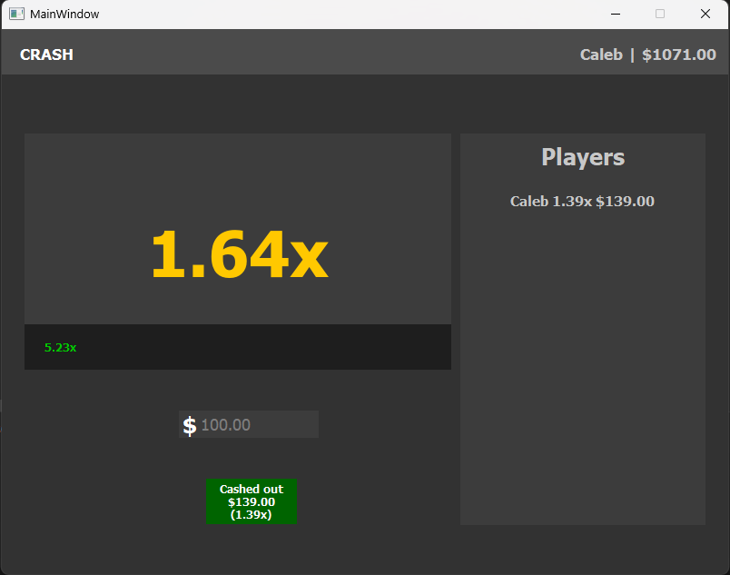

# Online Multiplayer Gambling App made with Python
## This program is an update to my previous gambling app. This modified version features a TCP server which allows the client to receive data at a much faster rate, resulting in a smoother experience.
### More information
#### This program uses pyqt5 for the ui, and sockets along with requests to request and receive data from the server. Meant to clone the popular game "Crash" from online gambling sites such as Stake and Roobet. It logs users in by asking for a username and automatically grabs the device's hostname so that it is relatively secure without the hassel of a password.
#### It also has multiplayer so that users can compete with their friends.

